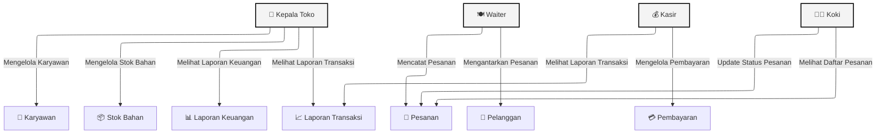
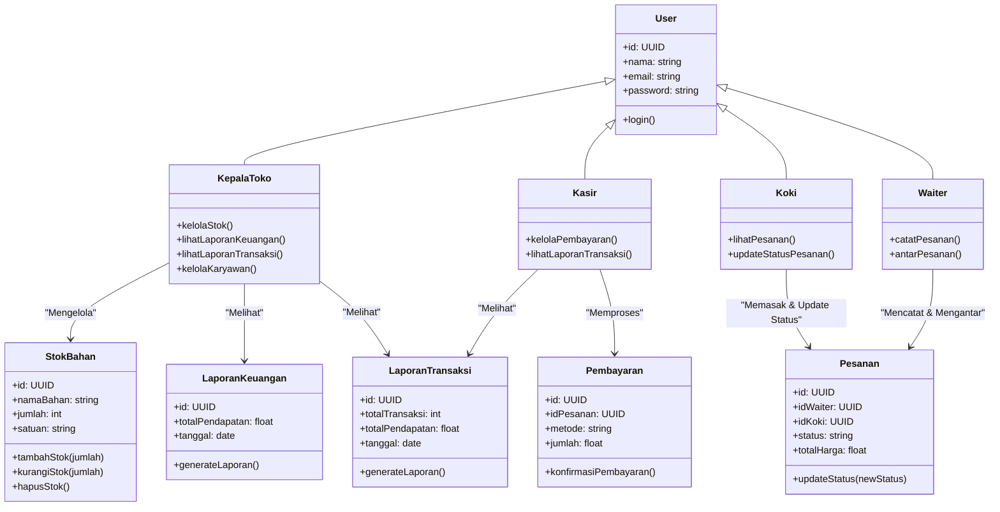
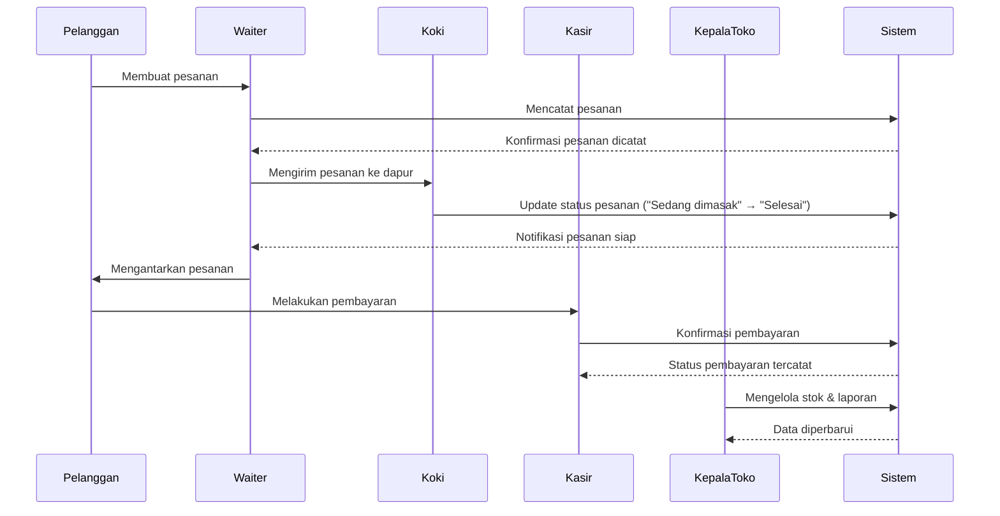

# 🧾 Manajemen Restoran - Fullstack ERP

Sistem ERP ini dibuat untuk membantu pengelolaan operasional restoran secara menyeluruh, mencakup pemesanan, pembayaran, manajemen stok, hingga pelaporan keuangan.

## 🛠️ Teknologi yang Digunakan

- **Backend**: [NestJS](https://nestjs.com/)  
- **Frontend**: [React](https://react.dev/) + [Vite](https://vitejs.dev/)  
- **Database**: PostgreSQL NeonDb 
- **ORM**: Prisma  
- **Diagram**: Mermaid.js  
- **Manual Monorepo**

## 📁 Struktur Direktori

```
manajemen-restoran/
├── backend/       # Source code NestJS (API)
├── frontend/      # Source code React + Vite (UI)
├── .gitignore
└── README.md
```

## 🚀 Cara Menjalankan Proyek

### 📦 1. Clone Repositori

```bash
git clone https://github.com/username/manajemen-restoran.git
cd manajemen-restoran
```

### 📁 2. Setup Backend

```bash
cd backend
npm install
npx prisma generate
npm run start:dev
```

### 🌐 3. Setup Frontend

```bash
cd ../frontend
npm install
npm run dev
```

## 🧠 Fitur Utama

- Pencatatan & manajemen pesanan  
- Pengelolaan stok bahan  
- Proses pembayaran & pelaporan  
- Role pengguna: Kepala Toko, Kasir, Koki, Waiter  
- Otentikasi pengguna  

---

## 📐 Desain Sistem

### **Use Case Diagram**


### **Class Diagram**


### **Sequence Diagram**

